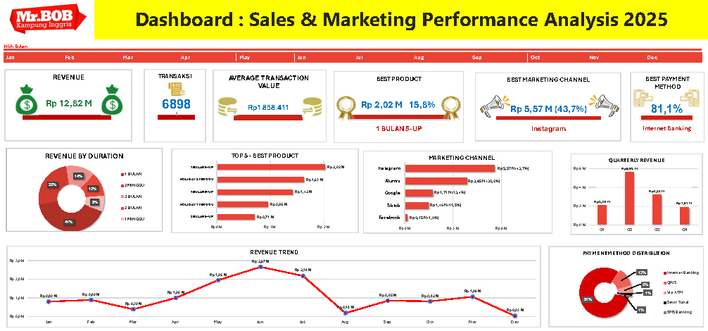

# 📊 English Course Sales & Marketing Analysis 2025

### Case Study: MR.BOB Kampung Inggris Pare

**An End-to-End Data Analytics Project using Microsoft Excel**

---

## 📖 Project Description

This project analyzes the sales and marketing performance of **MR.BOB Kampung Inggris Pare** throughout 2025 using Microsoft Excel.

The project demonstrates an **end-to-end data analytics workflow**, covering data preparation, exploratory data analysis (EDA), interactive dashboard development, business insight generation, and actionable business recommendations to support data-driven decision-making.

---

# 🚀 Project Highlights

- 📈 **Rp12.82 Billion** Total Revenue
- 🧾 **6,898 Transactions**
- 📅 **12-Month Sales Analysis**
- 📊 Interactive Excel Dashboard
- 📦 Product Performance Analysis
- 📢 Marketing Performance Analysis
- 💳 Payment Method Analysis
- 📅 Time-Based Sales Trend Analysis
- 💡 Business Insights & Recommendations

---

# 📑 Table of Contents

- [📌 Project Overview](#-project-overview)
- [🎯 Business Problem](#-business-problem)
- [🎯 Business Objective](#-business-objective)
- [📂 Dataset Information](#-dataset-information)
- [🔍 Scope of Analysis](#-scope-of-analysis)
- [🛠 Tools & Techniques](#-tools--techniques)
- [🔄 Project Workflow](#-project-workflow)
- [📊 Dashboard Preview](#-dashboard-preview)
- [📌 Key Findings](#-key-findings)
- [📈 Business Insights](#-business-insights)
- [💡 Business Recommendations](#-business-recommendations)
- [🎯 Project Outcomes](#-project-outcomes)
- [📁 Repository Structure](#-repository-structure)
- [🚀 Possible Future Improvements](#-possible-future-improvements)
- [👤 About the Author](#-about-the-author)

---

# 📌 Project Overview

This project evaluates the sales and marketing performance of **MR.BOB Kampung Inggris Pare** throughout 2025 using Microsoft Excel.

The analysis focuses on identifying sales trends, best-performing products, effective marketing channels, customer payment preferences, and seasonal sales patterns. The resulting insights are intended to support strategic business decisions related to marketing, product development, and operational planning.

---

# 🎯 Business Problem

MR.BOB offers multiple English learning programs with different durations, pricing structures, marketing channels, and payment methods. However, management requires a comprehensive analysis to better understand business performance and identify opportunities for sustainable growth.

This project answers the following business questions:

- Which programs generate the highest sales and revenue?
- Which program durations contribute the most to business performance?
- Which marketing channels acquire the most customers?
- Which payment methods are preferred by customers?
- How do sales perform across different months and quarters?
- Which products should be maintained, improved, or reevaluated?

---

# 🎯 Business Objective

The objective of this project is to analyze sales and marketing performance throughout 2025 to support strategic business decisions.

Specifically, this project aims to:

- Evaluate overall sales performance.
- Identify best-selling products and program durations.
- Measure the effectiveness of marketing channels.
- Analyze customer payment preferences.
- Identify monthly and quarterly sales trends.
- Generate business insights.
- Provide actionable business recommendations.

---

# 📂 Dataset Information

| Item | Description |
|------|-------------|
| Industry | Education (English Course) |
| Case Study | MR.BOB Kampung Inggris Pare |
| Data Source | Dummy dataset created for educational purposes using publicly available information from the official website |
| Analysis Period | January – December 2025 |
| Total Transactions | 6,898 |
| Total Variables | 6 |
| File Format | Microsoft Excel (.xlsx) |

## Dataset Characteristics

- Structured Dataset
- Transactional Dataset
- Sales Dataset
- Marketing Dataset
- Time-Series Dataset

## Dataset Variables

| Variable | Description |
|----------|-------------|
| Transaction Date | Date of Purchase |
| Payment Method | Customer Payment Method |
| Program | English Learning Program |
| Duration | Program Duration |
| Lead Source | Marketing Acquisition Channel |
| Revenue | Transaction Value |

---

# 🔍 Scope of Analysis

The project focuses on five key business areas:

- 📈 Sales Performance Analysis
- 📦 Product Performance Analysis
- 📢 Marketing Performance Analysis
- 💳 Payment Method Analysis
- 📅 Time-Based Sales Trend Analysis

---

# 🛠 Tools & Techniques

## Software

- Microsoft Excel

## Excel Features

- Pivot Table
- Pivot Chart
- Slicer
- Timeline
- Conditional Formatting

## Excel Functions

- SUMIFS
- COUNTIFS
- XLOOKUP
- IF
- TEXT
- MONTH
- YEAR
- Pivot Table Calculated Fields

## Analytical Techniques

- Data Cleaning
- Data Transformation
- Exploratory Data Analysis (EDA)
- Sales Performance Analysis
- Product Performance Analysis
- Marketing Performance Analysis
- Payment Method Analysis
- Time-Based Sales Trend Analysis
- KPI Analysis
- Business Insight Development
- Business Recommendation
- Data Visualization

---

# 🔄 Project Workflow

```text
Raw Dataset
      │
      ▼
Data Cleaning
      │
      ▼
Data Transformation
      │
      ▼
Exploratory Data Analysis (EDA)
      │
      ▼
Business Analysis
      │
      ▼
Interactive Dashboard Development
      │
      ▼
Business Insight Generation
      │
      ▼
Business Recommendations
```

---

# 📊 Dashboard Preview

The dashboard provides an interactive overview of the company's sales and marketing performance throughout 2025.

Users can dynamically explore the data using slicers and timelines.

## Dashboard Overview



## Sales Performance


## Product Performance


## Marketing Performance


## Payment Analysis


---

# 📌 Key Findings

| KPI | Result |
|------|---------|
| Total Revenue | **Rp12.82 Billion** |
| Total Transactions | **6,898** |
| Average Order Value | **Rp1.86 Million** |
| Best Selling Program | **1 BULAN 5-UP** |
| Best Marketing Channel | **Instagram** |
| Most Preferred Payment Method | **Internet Banking** |
| Best Performing Quarter | **Quarter II** |

---

# 📈 Business Insights

## 📈 Sales Performance

The business generated **Rp12.82 Billion** in revenue from **6,898 transactions**, with an average transaction value of approximately **Rp1.86 Million**, indicating a healthy sales performance throughout the year.

---

## 📦 Product Performance

The **1 BULAN 5-UP** program became the primary revenue driver, contributing approximately **15.78%** of total annual revenue.

Programs with a **1-month duration** generated approximately **41%** of total revenue, indicating strong customer preference for shorter learning programs.

---

## 📢 Marketing Performance

Instagram and Alumni contributed more than **73%** of total revenue, highlighting the effectiveness of digital marketing campaigns and referral-based customer acquisition.

---

## 💳 Payment Method Analysis

Internet Banking accounted for approximately **81%** of all transactions, indicating that customers strongly prefer digital payment methods.

---

## 📅 Time-Based Sales Analysis

Sales reached their highest levels during **Quarter II**, especially in **June** and **July**, suggesting strong seasonal demand during this period.

---

# 💡 Business Recommendations

| Priority | Recommendation |
|----------|----------------|
| 🔴 High | Increase investment in Instagram advertising campaigns to maximize customer acquisition. |
| 🔴 High | Expand the Alumni referral program by introducing referral incentives. |
| 🔴 High | Prepare operational resources before Quarter II to handle seasonal demand. |
| 🟡 Medium | Reevaluate Non-Camp programs by reviewing pricing strategies, promotional activities, and market demand. |
| 🟡 Medium | Continue improving digital payment options to enhance customer convenience and transaction efficiency. |

---

# 🎯 Project Outcomes

This project successfully demonstrates an **end-to-end data analytics workflow** using Microsoft Excel.

The analysis transformed raw transactional data into meaningful business insights through structured data preparation, exploratory analysis, dashboard development, and strategic recommendations.

The project demonstrates competencies in:

- Data Cleaning
- Data Transformation
- Exploratory Data Analysis (EDA)
- KPI Analysis
- Interactive Dashboard Development
- Business Analysis
- Data Visualization
- Business Insight Generation
- Business Recommendation
- Data Storytelling

---

# 📁 Repository Structure

```text
English-Course-Sales-Marketing-Analysis
│
├── README.md
├── LICENSE
│
├── main_dashboard
│   └── English Course Sales & Marketing Analysis 2025.xlsx
│
├── dataset
│   ├── raw_dataset.xlsx
│   └── cleaned_dataset.xlsx
│
├── report
│   └── English Course Sales & Marketing Analysis 2025.pdf
│
└── images
    ├── dashboard-overview.png
    ├── sales-performance.png
    ├── product-performance.png
    ├── marketing-performance.png
    └── payment-analysis.png
```

---

# 🚀 Possible Future Improvements

Future enhancements for this project may include:

- Developing an interactive dashboard using **Power BI**.
- Building SQL-based automated reporting workflows.
- Performing customer segmentation analysis.
- Developing predictive sales forecasting models.
- Creating executive KPI monitoring dashboards.
- Integrating customer retention and cohort analysis.
- Conducting profitability analysis by program category.
- Building interactive web dashboards using Tableau or Google Looker Studio.

---

# 👤 About the Author

## Hosea Meliala

**Junior Data Analyst**

I am an aspiring Data Analyst with a strong interest in **Data Analytics, Business Intelligence, Data Visualization, and Business Strategy**.

I enjoy transforming raw data into meaningful insights through structured analysis, interactive dashboards, and data storytelling to support better business decision-making.

### Areas of Interest

- Data Analytics
- Business Intelligence
- Dashboard Development
- Data Visualization
- Business Analysis
- KPI Analysis
- Data Storytelling

### Connect with Me

- GitHub: https://github.com/hoseasmeliala
- LinkedIn: https://linkedin.com/in/hoseasmeliala

---

⭐ If you found this project helpful or interesting, feel free to give this repository a **Star** and connect with me on GitHub!
